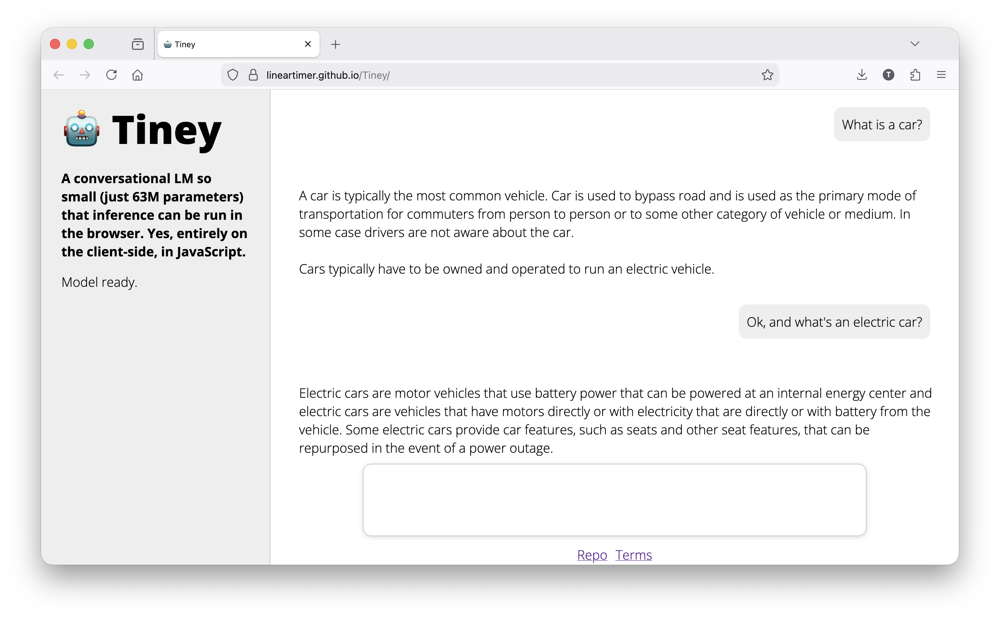

A tiny language model (~70 MB in size)
======================================

Tiney is a conversational language model that is so small that inference can be run in the browser. (Entirely on the client-side, in JavaScript.) The model has about 63 million parameters, which makes it half the size of the smallest version of GPT-2. The model was trained from scratch on roughly 10 GB of high-quality training data. The cost of training the model was less than 6 US dollars.

Despite its tiny size, the model can generate grammatically mostly correct English sentences that usually form relatively coherent text relevant to the input. The model, however, often hallucinates the answers.

You can try out the model [here](https://lineartimer.github.io/Tiney).

[](https://lineartimer.github.io/Tiney)

The goal of this project is twofold:
1. Demonstrate how to train language models including pretraining, fine-tuning and various optimizations in the training algorithm.
2. Provide boilerplate code using PyTorch that can serve as a starting point for the development of larger models.

The project was inspired by [one of Andrej Karpathy's great video tutorials](https://www.youtube.com/watch?v=l8pRSuU81PU). This repository is a cleaned-up, improved version of his code extended with some convenience features and a web-based user interface.

So: thanks, Andrej Karpathy 🙂

# Quickstart

Clone the repo.

## Run inference locally

1. Cd into src/frontend
2. Run `python -m http.server 8000`
3. Visit http://localhost:8000
4. Wait for the model to load (usually takes only a few seconds)
5. Enter a prompt and hit enter
6. Appreciate that a model that is only 70 MB in size is capable of mostly learning the rules of the English language as well as some rudimentary knowledge of the physical world 😉

## Reproducing the model

If you wish to reproduce the model, here's how to do it:

### Step 1: Pretraining

First, you need to download the training data for pretraining and train the tokenizer. To do that, start a terminal, cd into the `src` folder, and run `python model/prep_data.py -download`.

This will download a subset of the [fineweb-edu](https://huggingface.co/datasets/HuggingFaceFW/fineweb-edu) dataset. Since the size of the entire dataset is 10.4 TB and we only need 10 GB of training data, we can be very selective with what we include in our dataset (see `corpus.py` to find out about filtering).

To train the model from scratch, you will need a GPU with at least 20 GB of VRAM. If you don't have such a GPU, you can rent one from your favorite cloud provider. Currently, my favorite GPU provider is [RunPod](https://www.runpod.io). Their GPUs are very reasonably priced, you can pay as you go, and their user interface is very intuitive. You can buy a few dollars of credit in a prepaid fashion, and you're good to go. (No, I'm not being sponsored by them.)

I recommend using a [A4500](https://www.nvidia.com/en-eu/products/workstations/rtx-a4500/) GPU. At the time of this writing (January 2026), it costs $0.25/hour at RunPod.

Start a new on-demand, non-interruptible pod with one GPU. Make sure the 'SSH terminal access' and the 'Jupyter notebook' checkboxes are selected. Once the pod is up and running, open the Jupyter notebook, and create the following directory structure within the /workspace folder on the pod (you can upload the files manually through the web interface):

```
.
├── data
│   ├── corpus
│   └── tokenizer.json
└── src
    └── model
        ├── corpus.py
        ├── generate.py
        ├── model.py
        ├── prep_data.py
        ├── requirements.txt
        ├── train.py
        └── utils.py
```

Then open a terminal on the pod, cd into the `src` directory and run `pip install -r model/requirements.txt`.

Finally, you will need to upload the training data that you downloaded from Hugging Face. To do it, open a terminal on your local machine, cd into the `src` directory and run `scp -P <port number> ../data/corpus/val.txt root@<ip address>:/workspace/data/corpus` where you replace `<ip address>` and `<port number>` with the ip address and the SSH port number of the pod. (Click your pod in the RunPod console and you will find the ip address and the port number on the Connect tab under SSH settings.) Do the same with train.txt.

Now, everything is ready to start the pretraining. Open a terminal on the pod, cd into the `src` directory and run `python model/train.py`.

### Step 2: Fine-tuning

Once the pretraining has finished, you can fine-tune your model so that it acts more conversational. To do the fine-tuning, you can use a small, open source, manually created dataset from Databricks.

To download this dataset manually:
1. Move the train.txt, val.txt and test.txt files used for pretraining to somewhere else from the data/corpus folder (the folder should be empty)
2. Download the dataset (databricks-dolly-15k.jsonl) from [here](https://huggingface.co/datasets/databricks/databricks-dolly-15k/tree/main) and save it in the data/corpus folder

Start a terminal, cd into `src` and run `python model/prep_data.py -finetune`.

This will create the training data (train.txt, val.txt, test.txt) for the fine-tuning step. Replace the training data on the pod with this newly created data.

Now, open a terminal on the pod, cd into the `src` directory and run `python model/train.py -finetune`.

This will fine-tune your base model and make it more conversational. Because of the early stopping algorithm, the training will continue for as long as the validation loss is going down (several epochs).

At the end of the training, the model will be exported to onnx format. The size of this file should be under 100 MB (after quantization), which is the maximum file size that GitHub allows in its repositories.

Once the fine-tuning has been done, download the onnx file and save it in the src/frontend folder. After commiting the change and pushing it to the repository, an automatic update to the GitHub page will be triggered (see `.github/workflows/publish.yml`). Once the GitHub action has finished, you should be able to access the model as a GitHub page in your repo.

Happy (LM) training!
